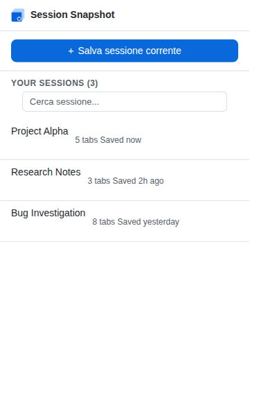
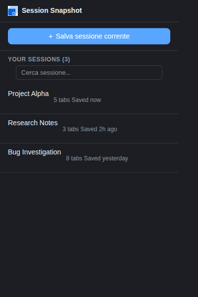
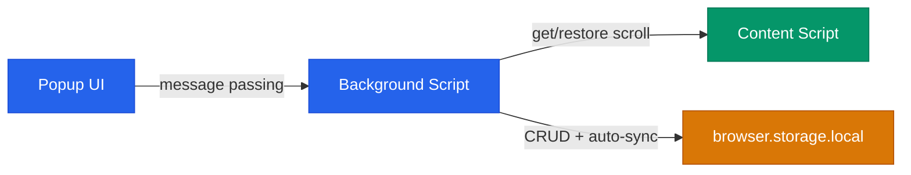
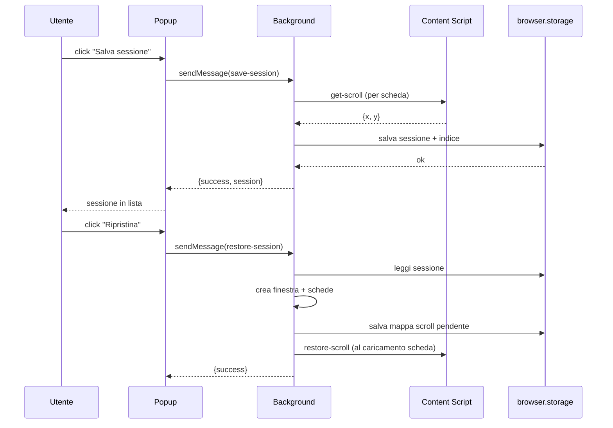

[English](README.md) | **Italiano**

# Session Snapshot

Un'estensione Firefox per salvare e ripristinare sessioni di lavoro nel browser. Ogni sessione cattura le schede aperte e la posizione di scroll, ripristinandole in una finestra dedicata con sincronizzazione automatica.

[](https://github.com/AndreaBonn/firefox-session-snapshot/actions/workflows/ci.yml)
[](https://github.com/AndreaBonn/firefox-session-snapshot/actions/workflows/ci.yml)
[](https://github.com/AndreaBonn/firefox-session-snapshot/actions/workflows/ci.yml)


|                      Tema chiaro                       |                      Tema scuro                      |
| :----------------------------------------------------: | :--------------------------------------------------: |
|  |  |

## Funzionalita

- Salva tutte le schede della finestra corrente come sessione con nome e colore
- Ripristina le sessioni in una finestra separata con posizione di scroll preservata
- Auto-sync: le finestre ripristinate tracciano le modifiche alle schede (aggiunta, rimozione, navigazione) e aggiornano la sessione automaticamente
- Etichetta le sessioni con tag per organizzarle, cercabili dalla barra di filtro
- Esporta tutte le sessioni (o una singola) come JSON per backup e migrazione
- Importa sessioni da file JSON con validazione e gestione nomi duplicati
- Ricerca e filtro delle sessioni salvate per nome o tag
- Rinomina inline con gestione automatica dei duplicati
- Supporto undo sulle azioni distruttive (eliminazione) tramite notifica toast - funziona anche se il popup viene chiuso
- Indicatore spazio storage nel footer del popup
- Tema chiaro e scuro seguendo la preferenza di sistema
- Scorciatoie tastiera: Ctrl+Shift+S (salvataggio rapido), Ctrl+Shift+W (apri popup)

## Architettura



L'estensione usa le API Manifest V2 di Firefox con tre livelli:

- **Popup** renderizza la lista sessioni, gestisce le interazioni utente e invia comandi al background script tramite `browser.runtime.sendMessage`.
- **Background** (event page, non persistente) gestisce il CRUD delle sessioni, traccia le finestre ripristinate per l'auto-sync e coordina cattura/ripristino dello scroll.
- **Content script** gira su tutte le pagine per leggere e ripristinare la posizione di scroll su richiesta.

### Flusso salvataggio e ripristino



## Struttura del repository

```text
.
├── background/              # Logica sessioni (modulare)
│   ├── validation.js        # Costanti, sanitizzazione input, validazione URL e tag
│   ├── storage.js           # Helper storage lettura/scrittura
│   ├── session-crud.js      # Salva, ripristina, elimina, rinomina, aggiorna, tag
│   ├── auto-sync.js         # Sync finestre tracciate, ripristino scroll, event listener
│   ├── export-import.js     # Export/import JSON con validazione, statistiche storage
│   └── background.js        # Message listener, eliminazione differita, scorciatoie
├── content/
│   └── scroll-capture.js    # Get/restore posizione scroll via messaggi
├── popup/                   # UI popup dell'estensione
│   ├── popup.html           # Markup popup
│   ├── popup.js             # Lista sessioni, form salvataggio, context menu, rinomina
│   ├── popup.css            # Stili tema chiaro/scuro
│   ├── tags.js              # Input tag, editor tag modale
│   ├── export-import.js     # UI export/import, indicatore storage
│   ├── search.js            # Filtro sessioni per nome e tag in tempo reale
│   ├── toast.js             # Notifiche toast (undo e informative)
│   └── ui-utils.js          # Helper condivisi (escapeHtml, formatAge, colori)
├── icons/                   # Icone estensione (16/32/48/96/128px)
├── tests/                   # Test unitari Jest (jsdom)
├── manifest.json            # Manifest estensione (Manifest V2)
└── package.json             # Dipendenze dev e script
```

## Prerequisiti

- Firefox 91 o successivo
- Node.js 18+ (solo per sviluppo: linting e test)

## Installazione

1. Clona il repository:

```bash
git clone https://github.com/AndreaBonn/firefox-session-snapshot.git
cd firefox-session-snapshot
```

2. Installa le dipendenze di sviluppo:

```bash
npm install
```

3. Carica l'estensione in Firefox:
   - Apri `about:debugging#/runtime/this-firefox`
   - Clicca "Carica componente aggiuntivo temporaneo..."
   - Seleziona `manifest.json` dalla root del repository

L'estensione resta attiva fino alla chiusura di Firefox. Ripeti il passaggio 3 dopo ogni riavvio.

## Esecuzione locale

| Comando                 | Descrizione                 |
| ----------------------- | --------------------------- |
| `npm test`              | Esegui test (Jest, verbose) |
| `npm run test:coverage` | Test con report copertura   |
| `npm run lint`          | Lint con ESLint             |
| `npm run lint:fix`      | Lint con auto-fix           |
| `npm run format`        | Formatta con Prettier       |
| `npm run format:check`  | Verifica formattazione      |

## Testing

I test usano Jest con ambiente jsdom, nella cartella `tests/`. I file test rispecchiano i moduli sorgente:

- `background.test.js` - CRUD sessioni, message handler, auto-sync
- `popup.test.js` - rendering UI, interazioni utente
- `scroll-capture.test.js` - comportamento content script
- `search.test.js` - logica di filtro
- `toast.test.js` - notifiche toast e undo

## Sicurezza

Validazione input, filtro URL e output escaping sono implementati nell'estensione. Per dettagli e segnalazione vulnerabilita, consulta [SECURITY.md](./SECURITY.it.md).

## Licenza

Rilasciato sotto Apache License 2.0. Vedi [LICENSE](./LICENSE).

## Supporta il progetto

Se Session Snapshot ti e stato utile, lascia una [stella su GitHub](https://github.com/AndreaBonn/firefox-session-snapshot) - aiuta altri a scoprirlo.
