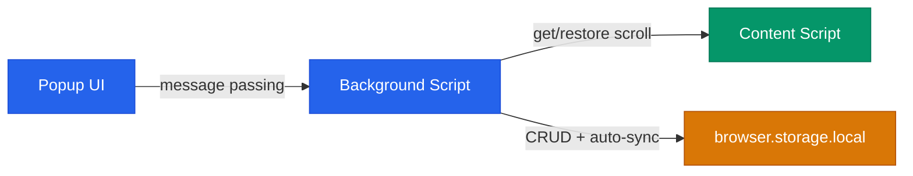
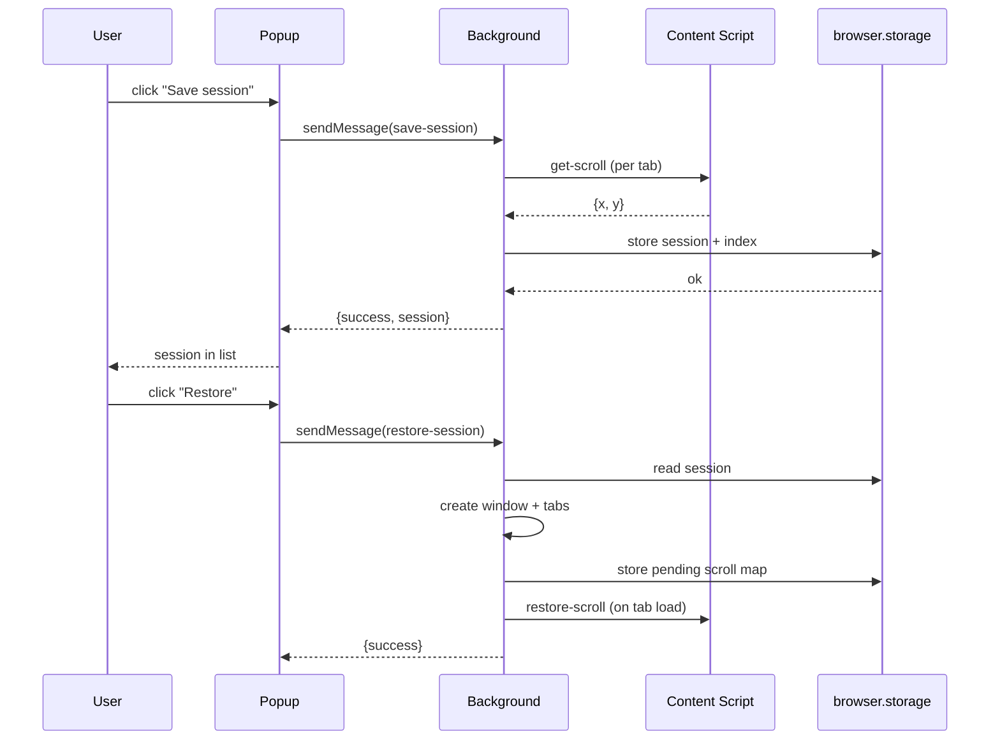

**English** | [Italiano](README.it.md)

# Session Snapshot

A Firefox extension that saves and restores browser working sessions. Each session captures open tabs and their scroll positions, and restores them in a dedicated window with automatic sync.

[](https://github.com/AndreaBonn/firefox-session-snapshot/actions/workflows/ci.yml)
[](https://github.com/AndreaBonn/firefox-session-snapshot/actions/workflows/ci.yml)
[](https://github.com/AndreaBonn/firefox-session-snapshot/actions/workflows/ci.yml)


## Features

- Save all tabs from the current window as a named, color-coded session
- Restore sessions in a separate window with scroll position preserved
- Auto-sync: restored windows track tab changes (add, remove, navigate) and update the session automatically
- Search and filter saved sessions by name
- Inline rename with automatic duplicate handling
- Undo support on destructive actions (delete) via toast notification
- Dark and light theme following system preference
- Keyboard shortcuts: Ctrl+Shift+S (quick save), Ctrl+Shift+W (open popup)

## Architecture



The extension uses Firefox's Manifest V2 API with three layers:

- **Popup** renders the session list, handles user interactions, and sends commands to the background script via `browser.runtime.sendMessage`.
- **Background** (event page, non-persistent) manages session CRUD, tracks restored windows for auto-sync, and coordinates scroll capture/restore.
- **Content script** runs on all pages to read and restore scroll positions on demand.

### Save and restore flow



## Repository structure

```text
.
├── background/            # Session logic, storage, auto-sync, validation
│   ├── background.js      # Core CRUD, message handler, window tracking
│   └── validation.js      # Constants, input sanitization, URL filtering
├── content/
│   └── scroll-capture.js  # Scroll position get/restore via messages
├── popup/                 # Extension popup UI
│   ├── popup.html         # Popup markup
│   ├── popup.js           # Session list rendering, forms, context menu
│   ├── popup.css          # Light/dark theme styles
│   ├── search.js          # Real-time session filtering
│   ├── toast.js           # Undo-capable toast notifications
│   └── ui-utils.js        # Shared helpers (escapeHtml, formatAge, colors)
├── icons/                 # Extension icons (16/32/48/96px)
├── tests/                 # Jest unit tests (jsdom)
├── manifest.json          # Extension manifest (Manifest V2)
└── package.json           # Dev dependencies and scripts
```

## Prerequisites

- Firefox 91 or later
- Node.js 18+ (development only, for linting and tests)

## Installation

1. Clone the repository:

```bash
git clone https://github.com/AndreaBonn/firefox-session-snapshot.git
cd firefox-session-snapshot
```

2. Install dev dependencies:

```bash
npm install
```

3. Load the extension in Firefox:
   - Open `about:debugging#/runtime/this-firefox`
   - Click "Load Temporary Add-on..."
   - Select `manifest.json` from the repository root

The extension stays active until Firefox is closed. Repeat step 3 after restarting.

## Running locally

| Command                 | Description                    |
| ----------------------- | ------------------------------ |
| `npm test`              | Run tests (Jest, verbose)      |
| `npm run test:coverage` | Run tests with coverage report |
| `npm run lint`          | Lint with ESLint               |
| `npm run lint:fix`      | Lint with auto-fix             |
| `npm run format`        | Format with Prettier           |
| `npm run format:check`  | Check formatting               |

## Testing

Tests use Jest with jsdom environment, located in `tests/`. Test files mirror source modules:

- `background.test.js` - session CRUD, message handler, auto-sync
- `popup.test.js` - UI rendering, user interactions
- `scroll-capture.test.js` - content script behavior
- `search.test.js` - filtering logic
- `toast.test.js` - toast notifications and undo

## Security

Input validation, URL filtering, and output escaping are implemented across the extension. For details and vulnerability reporting, see [SECURITY.md](./SECURITY.md).

## License

Released under the Apache License 2.0. See [LICENSE](./LICENSE).

## Support the project

If you found Session Snapshot useful, consider giving it a [star on GitHub](https://github.com/AndreaBonn/firefox-session-snapshot) - it helps others discover it.
